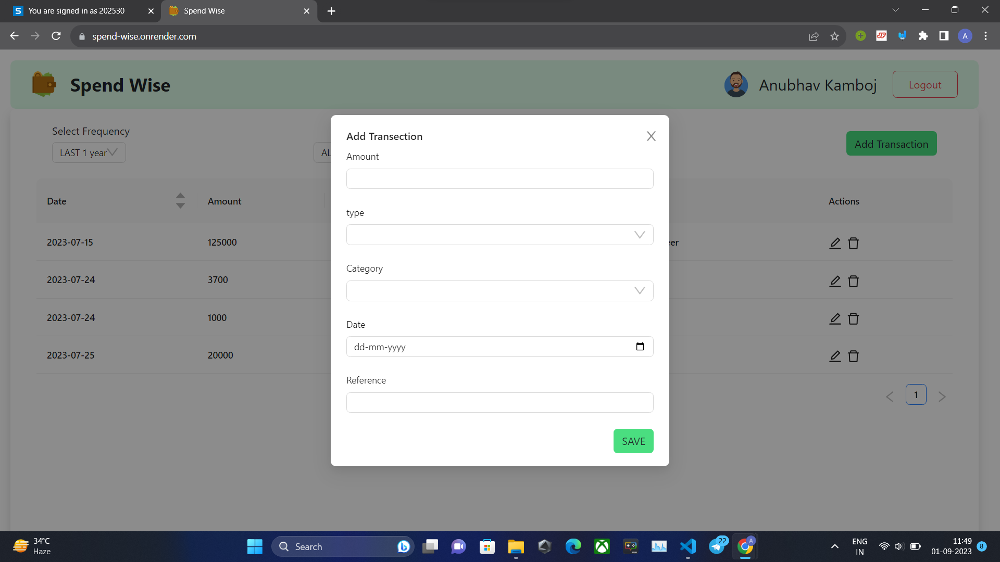

# spendWise
- Designed and developed an expense management website that enabled individuals to efficiently track and manage
their expenses.
- The web-based application performed all CRUD (Create, Read, Update, Delete) operations to efficiently manage
individual's needs.
- Included User Authentication that makes this application accessible to multiple users
- Live Demo [https://spend-wise.onrender.com/](https://spend-wise.onrender.com/)

# Technologies Used
- ReactJS
- Nodejs
- Express
- MongoDB
- JavaScript

# Tools
- VS Code
- Github

# Functionalities and Features

- Expense management
- Performed all CRUD

# ScreenShots

